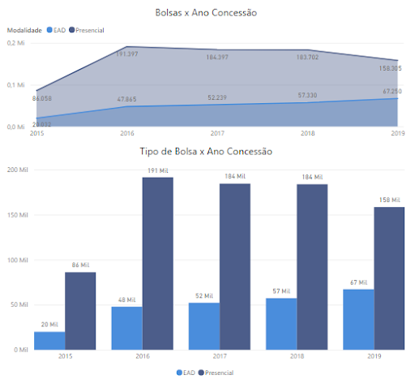
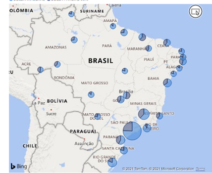
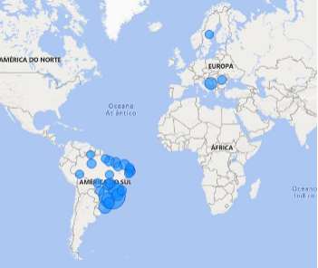
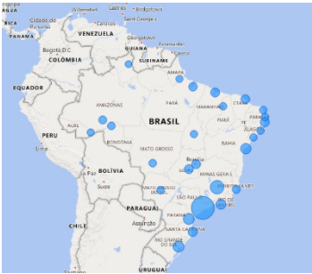
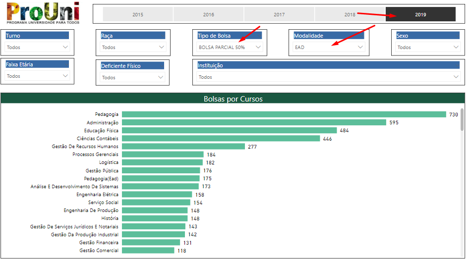
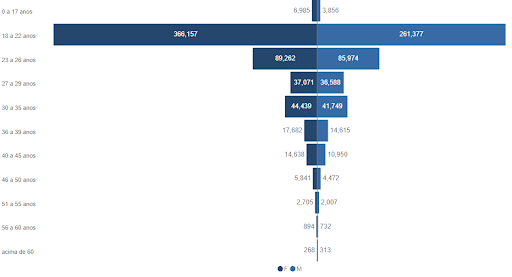
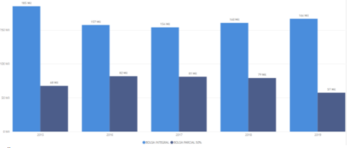

# 2022-5A — Bootcamp Cientista de Dados

## Módulo 4 - Análise de Dados Utilizando Dashboards

## Pergunta 1 - No Dashboard Estratégico é necessária a presença destes dois gráficos?

- Falso
- Verdadeiro

## Pergunta 2 - As cores utilizadas para o tema estão CORRETAS?

- Verdadeiro
- Falso

## Pergunta 3 - Analisando como público mais alto da pirâmide organizacional, a quantidade de visualizações adotadas no Dashboard Estratégico está adequada?

- Verdadeiro
- Falso

## Pergunta 4 - O mapa abaixo apresenta as fatias de cada tipo de bolsa em cada um dos Estados?

- Verdadeiro
- Falso

## Pergunta 5 - O uso do ícone para representar a deficiência física é uma boa prática como adotado no painel Operacional?

- Falso
- Verdadeiro

## Pergunta 6 - Baseado no Storytelling, analise a afirmação

> “O uso da Pirâmide Etária não é necessário neste contexto. A construção de duas visualizações separadas, uma para mostrar a visão por faixa etária e outra por sexo seria o mais adequado.”

- Verdadeiro
- Falso

## Pergunta 7 - No Power BI, muito provavelmente você encontrou dificuldades para construção do Mapa por UF, o que não ocorre com a ferramenta Tableau. Qual a alternativa mais simples que você utilizaria para correção e apresentação correta na ferramenta da Microsoft?

- Criaria uma nova coluna personalizada através da concatenação da coluna SIGLA_UF_BENEFICIARIO_BOLSA com o texto “, Brasil”.
- Criaria uma nova coluna personalizada através da concatenação da coluna SIGLA_UF_BENEFICIARIO_BOLSA com o texto “Brasil”.
- Realizaria a substituição de todos os registros na tabela original pelo campo por extenso contendo o nome dos estados.
- Unificaria com uma outra base de dados contendo a sigla da UF e o nome por extenso dos estados, depois concatenaria com o texto Brasil.

## Pergunta 8 - Analise a afirmação

> “Analisando os dados, percebe-se que o número de bolsas Presencial continua crescendo frente às bolsas concedidas para os cursos na modalidade EaD.”

- Falso
- Verdadeiro

## Pergunta 9 - Analise a afirmação

> “Analisando os dados nota-se que o número de bolsas concedidas no ano de 2019 é menor do que ano de 2018, mas é maior do que o do ano de 2017.”

- Verdadeiro
- Falso

## Pergunta 10 - Analise a afirmação

> “Pode-se afirmar que o número de pessoas concedidas com bolsas de estudo ProUni de 2016 até o ano 2019, por pessoas declaradas tendo como raça Preta, não tem variado muito, mas há uma queda constante da distribuição de bolsas da raça Branca .”

- Verdadeiro
- Falso

## Pergunta 11 - Analise a afirmação

> “A universidade no ano de 2019 que mais concede bolsas, possui um número superior à soma da segunda, terceira e quarta colocadas juntas.”

- Verdadeiro
- Falso

Pergunta 12 - Analise a afirmação baseado na figura abaixo:

> “No ano de 2019, na Modalidade EaD o curso de Pedagogia foi o que mais recebeu bolsas do ProUni Parcial 50%.”

- Falso.
- Verdadeiro.

## Pergunta 13 - Analise a afirmação baseado na figura abaixo onde já foram aplicados alguns filtros

> “O gráfico que da Pirâmide Etária apresenta na faixa de 23 a 26 anos a segunda que mais é contemplada com bolsas do ProUni para o sexo masculino.”

- Falso
- Verdadeiro

## Pergunta 14 - Analise a afirmação baseado na figura abaixo

> “Uma das opções que poderia ser utilizado no lugar do gráfico de Colunas, seria o gráfico de pizza.”

- Falso
- Verdadeiro
