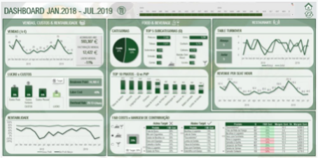

# Bootcamp: Cientista de Dados - Trabalho Prático

- Data: julho de 2022.

## Autor

Feito com :heart: por [Alexsander Lopes Camargos](https://github.com/alexcamargos) :wave: Entre em contato!

## Licença

[MIT License](https://choosealicense.com/licenses/mit/)

## Pergunta 1 - Sobre o OLAP é CORRETO dizer que

- Não permite criação de relatórios pelos usuários e sim somente o conjunto que lhes é entregue.
- Permite atualização de dados.
- Está entre o processo de especificação e de carga de dados.
- Permite aos gestores obter respostas rápidas, consistentes e interativas, sem que o usuário consiga modificar os dados armazenados.

## Pergunta 2 - Analise a afirmação sobre os Cubos OLAP e avalie como sendo VERDADEIRO ou FALSO

> “Os cubos podem exibir e somar grandes quantidades de dados enquanto fornecem aos usuários acesso pesquisável a quaisquer pontos de dados”

- Verdadeiro
- Falso

## Pergunta 3 - Analise a imagem a afirmação e então avalie como sendo VERDADEIRO ou FALSO

> “Uma foto datada sobre a queda do muro de Berlim é uma forma de representar visualmente um fato histórico”.

- Falso
- Verdadeiro

## Pergunta 4 -Marque a alternativa que NÃO apresenta o conceito correto sobre Visualização de Dados

- Os elementos de visualização de dados nos Dashboards podem ser Tabelas, Gráficos, Mapas, dentre outros.
- Uma visualização de dados eficaz pode significar a diferença entre o sucesso e o fracasso na hora de comunicar.
- É um termo genérico que não abrange todos os tipos de representações visuais.
- Resolver problemas, criar soluções e é feito para encantar seu público.

## Pergunta 5 - Analise a afirmação sobre Dashboards e avalie como sendo VERDADEIRO ou FALSO

> “Os gráficos são as representações mais utilizadas, pois são os que melhor resumem os dados para serem apresentados”.

- Falso
- Verdadeiro

## Pergunta 6 - Marque a alternativa que NÃO apresenta o conceito correto sobre Dashboards

- Tipicamente, são gerados para todos os funcionários de uma empresa, independente de sua função.
- É um display visual das informações mais importantes necessárias para alcançar um ou mais objetivos, consolidados e organizados em uma única tela.
- Informação possa ser monitorada em um piscar de olhos.
- Na tradução simples é um painel de indicadores.

## Pergunta 7 - Marque a alternativa que NÃO apresenta o conceito correto para o público Tomadores de Decisão

- Tabelas detalhadas.
- Gráficos resumidos.
- Principais KPIs.
- Público menos técnico.

## Pergunta 8 - Analise a afirmação sobre o público Analistas e avalie como sendo VERDADEIRO ou FALSO

> “Necessitam de Dashboards com mais detalhes, pois o objetivo é ajudá-los a explorar visualmente os dados para que eles cheguem às próprias conclusões”.

- Falso
- Verdadeiro

## Pergunta 9 - Marque a alternativa que NÃO apresenta o conceito correto para o público Percepção Visual

- Sistema 1 – rápido, automático, frequente, emocional, subconsciente e estereotipado. ed.
- A informação que tem maior relevância é selecionada para ser processada conscientemente no Sistema 1.
- Nenhuma das alternativas está correta.
- Sistema 2 – lento, trabalhoso, infrequente, lógico, consciente e calculista.

## Pergunta 10 - Marque a alternativa que NÃO apresenta o conceito correto para Representações Eficientes

- Sempre que possível rotular os gráficos.
- Seguem convenções.
- Devem ser simples e diretas.
- Atraentes, mas sem prender a atenção.

## Pergunta 11 - O Dashboard abaixo apresenta características mais OPERACIONAL pelo fato de conter muitos detalhes sobre o negócio

- Verdadeiro
- Falso

## Pergunta 12 - Marque a alternativa que NÃO apresenta o conceito correto sobre a utilização de CORES

- O excesso de cores traz um aspecto cansativo ao painel.
- Utilize as cores corretas do tema.
- As cores possuem um papel muito importante nos destaques que se deseja dar à informação, mas não mostram alertas que precisam ser monitorados.
- Quando necessário, utilize as cores na identidade visual da empresa.

## Pergunta 13 - Analise a afirmação sobre o uso do gráfico de Pizza e avalie como sendo VERDADEIRO ou FALSO

> “Pode ser utilizado em análises que usem dados temporais, como por exemplo, mostrar a evolução dos últimos 24 meses”.

- Falso
- Verdadeiro

## Pergunta 14 - Analise a afirmação sobre Data Stoytelling e avalie como sendo VERDADEIRO ou FALSO

> “É a arte de contar a história com dados. Mas suas ferramentas não sabem qual é essa história”.

- Verdadeiro
- Falso
